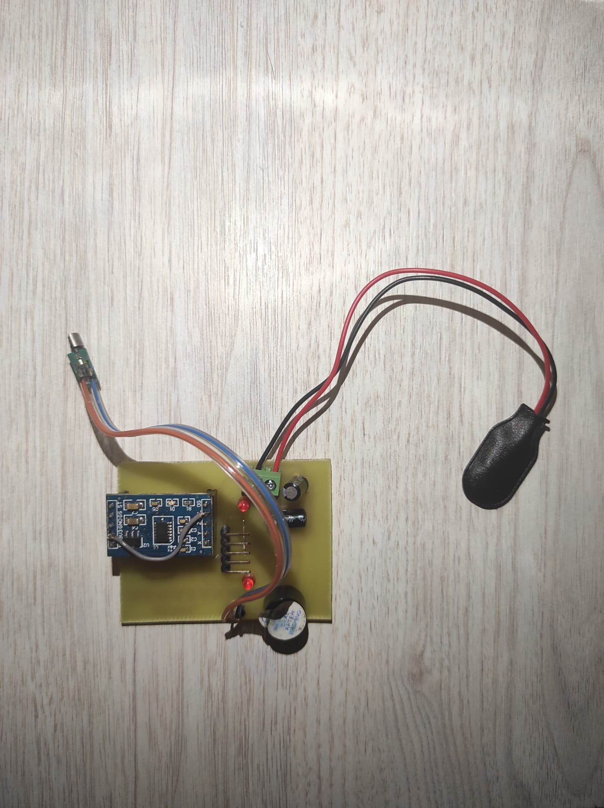

# 🧍 Dik Durma Uyarı Cihazı

> Ergonomik bir yaklaşımla, kullanıcıları yanlış oturma pozisyonuna karşı titreşim ve sesli uyarıyla bilgilendiren gömülü sistem projesi.

**Ders:** BMH-61 — Bilgisayar Mühendisliği Proje  
**Danışman:** Dr. Öğr. Üyesi Mehmet Karabulut  
**Ekip:** Ramazan Acar · Anıl Mert Temel · Emin Hayrettin Coşar  
**Yıl:** 2024

---

## 📷 Donanım Fotoğrafı



> Devre kartı, 9V VARTA pil, hoparlör ve MicroSD kart adaptörü ile birlikte prototip hali.

---

## 📌 Proje Hakkında

Modern yaşamın getirdiği uzun süreli oturma alışkanlıkları; bel, boyun ve sırt problemlerine yol açmaktadır. Bu proje, kullanıcının duruş açısını sürekli izleyen ve dik oturulmadığı tespit edildiğinde **titreşim + sesli uyarı** veren taşınabilir bir gömülü sistem cihazı geliştirmeyi amaçlamaktadır.

Cihaz, bir şapkanın içine veya yelek/gömleğin sırt kısmına yerleştirilerek taşınabilir şekilde kullanılır. Sensörden gelen analog veri mikrodenetleyicide işlenir; belirli bir eşik aşıldığında kullanıcı anında uyarılır.

---

## ⚙️ Donanım Bileşenleri

| Bileşen | Açıklama |
|---|---|
| **MMA7361** | 3 eksenli ivme sensörü — duruş açısını ölçer |
| **PIC16F886** | Ana mikrodenetleyici — analog veriyi işler |
| **Titreşim Motoru** | Eşik aşıldığında titreşim uyarısı üretir |
| **Buzzer** | Sesli uyarı çıkışı |
| **Transistör** | PIC'in yetersiz akımını tamponlar (buffer) |
| **Diyot** | Motordan gelen zıt EMK'yı söndürür, devreyi korur |
| **Voltaj Regülatörü** | Dalgalı giriş voltajını sabit çıkışa dönüştürür |
| **LED** | Durum göstergesi |
| **Klemens** | PIC'i sökmeden harici programlama imkânı |
| **DFPlayer Mini** | Sesli uyarı için MP3 modülü |

---

## 🔄 Çalışma Prensibi

```
[MMA7361 Sensör]
       │
       │  Analog sinyal (duruş açısı)
       ▼
[PIC16F886 Mikrodenetleyici]
       │
       │  ADC ile dijitale çevir
       │  Eşik değeriyle karşılaştır
       │
   ┌───┴────────────────────┐
   │ Dik oturuyor           │ Eğik oturuyor
   ▼                        ▼
[Sessiz / Bekleme]    [Titreşim Motoru + Buzzer]
                            │
                      Kullanıcı uyarılır,
                      duruşunu düzeltir
```

---

## 💻 Yazılım

Proje **CCS C** derleyicisi ile geliştirilmiş olup `PIC16F886` mikrodenetleyicisi hedef alınmaktadır.

### Kaynak Dosyalar

```
📁 proje/
├── ses_mic_sd_886.c     # Ana kaynak kod (CCS C)
└── ses_mic_sd_886.hex   # Derlenmiş HEX dosyası (PIC'e yüklenir)
```

### Temel Yapılandırma

```c
#include <16f886.h>
#device adc=8

// Fuse ayarları
#fuses HS, NOWDT, NOPUT, MCLR, NOPROTECT, NOLVP

// 20 MHz osilatör
#use delay(clock=20000000)

// Seri haberleşme — DFPlayer MP3 modülü
#use rs232(baud=9600, xmit=PIN_B0, stream=DFPLAYER)

// RS232 — harici haberleşme
#use rs232(baud=9600, xmit=PIN_C6, rcv=PIN_C7, stream=RS232)
```

### Ana Döngü Mantığı

```c
void main() {
    setup_adc_ports(sAN0);         // AN0 pini ADC olarak ayarla
    setup_adc(adc_clock_div_32);   // ADC saat frekansı
    volume(29);                    // Ses seviyesi ayarı

    while(TRUE) {
        aoku();                    // ADC'den sensör verisini oku
        if (a0 > 100) {            // Eşik: 100 (0–255 ölçeği)
            output_high(pin_c0);   // LED yak
            play();                // Sesli uyarı başlat
            delay_ms(2000);        // 2 saniye bekle
        }
        output_low(pin_c0);        // LED söndür
    }
}
```

---

## 🚀 Kurulum ve Programlama

### Gereksinimler

- [MPLAB X IDE](https://www.microchip.com/mplab/mplab-x-ide) veya CCS C Compiler
- PIC programlayıcı (PICkit 3/4 veya uyumlu)
- Devre şeması (bkz. proje raporu)

### HEX Dosyasını PIC'e Yükleme

1. PICkit veya benzeri bir programlayıcıyı bilgisayara bağlayın.
2. Klemens üzerinden PIC16F886'ya bağlantı yapın (**cihazı sökmeden programlama desteklenir**).
3. MPLAB IPE veya CCS Programmer aracını açın.
4. `ses_mic_sd_886.hex` dosyasını seçin.
5. **Program** butonuna tıklayın.

### Kaynak Koddan Derleme

```bash
# CCS C Compiler ile
ccsc +FM ses_mic_sd_886.c
# Çıktı: ses_mic_sd_886.hex
```

---

## 📊 Teknik Özellikler

| Parametre | Değer |
|---|---|
| Mikrodenetleyici | PIC16F886 |
| Osilatör Frekansı | 20 MHz |
| ADC Çözünürlüğü | 8-bit (0–255) |
| Duruş Eşik Değeri | 100 (ADC birimi) |
| Uyarı Gecikme Süresi | 2000 ms |
| Seri Haberleşme Hızı | 9600 baud |
| Besleme Voltajı | Düzenlenmiş sabit DC |

---

## 🔮 Gelecek Geliştirmeler

- [ ] Mobil uygulama entegrasyonu (Bluetooth/BLE)
- [ ] Duruş pozisyonu geçmişi ve sağlık verisi kaydı
- [ ] Kişiselleştirilebilir eşik değeri
- [ ] Pil yönetimi ve düşük güç modu
- [ ] LCD ekran ile anlık açı gösterimi

---

## 📚 Referanslar

- Akkan, T., & Senol, Y. (2008). *Capturing and analysis of knee-joint signals using accelerometers.* IEEE 16th Signal Processing, Communication and Applications Conference.
- Akkan, T., Şenol, Y., & Özgören, M. (2022). *Multi-Point Multi-Dimensional Accelerometer Data Logging System for Biomedical Applications.* Dokuz Eylül Üniversitesi Mühendislik Fakültesi Fen ve Mühendislik Dergisi, 24(72), 787–797.

---

## 📄 Lisans

Bu proje akademik amaçlı geliştirilmiştir. Ticari kullanım için izin alınması gerekmektedir.

---

*Mühendislik ve Mimarlık Fakültesi Proje Etkinliği ve Yarışması — 2024*
